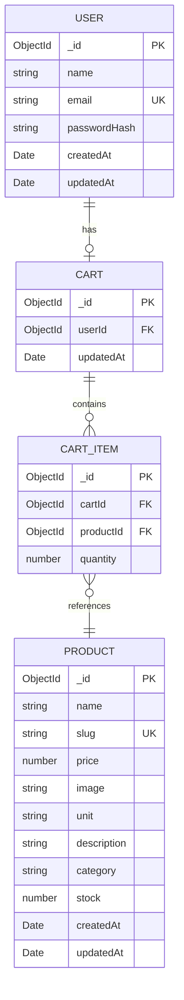

# Entity Relationship Diagram

```mermaid
erDiagram
    USER ||--o| CART : has
    CART ||--o{ CART_ITEM : contains
    CART_ITEM }o--|| PRODUCT : references

    USER {
        ObjectId _id PK
        string name
        string email UK
        string passwordHash
        Date createdAt
        Date updatedAt
    }

    PRODUCT {
        ObjectId _id PK
        string name
        string slug UK
        number price
        string image
        string unit
        string description
        string category
        number stock
        Date createdAt
        Date updatedAt
    }

    CART {
        ObjectId _id PK
        ObjectId userId FK
        Date updatedAt
    }

    CART_ITEM {
        ObjectId _id PK
        ObjectId cartId FK
        ObjectId productId FK
        number quantity
    }
```
