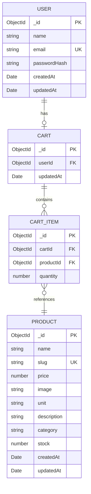

# WeBuyAm Clone

A recreation of the webuyam.com Shop experience, built as a technical assessment for Kitovu Technology Company.

## Live Demo

| | URL |
|---|---|
| Frontend | https://webuyam-clone.vercel.app |
| Backend API | https://webuyam-clone.onrender.com |
| Health check | https://webuyam-clone.onrender.com/api/health |
| Test credentials | Register a new account via the UI |

## Tech Stack

| Frontend | Backend |
|---|---|
| React 18 + Vite | Node.js + Express |
| TypeScript (strict) | TypeScript (strict) |
| Zustand (auth state) | Mongoose + MongoDB |
| TanStack Query (server state) | Zod (validation) |
| React Router v6 | JWT + bcrypt (auth) |
| Tailwind CSS | Custom error middleware |
| react-toastify | CORS configured |
| Axios | dotenv |

## Architecture Highlights

State is split deliberately between two layers: Zustand owns client-side auth state (user profile + JWT token, persisted to localStorage), while TanStack Query owns all server state — product listings, product detail, and cart data are never duplicated in Zustand. The cart sidebar badge reads directly from the same TanStack Query cache as the cart page, so any mutation (add, update, remove) updates the badge instantly through optimistic updates and query invalidation.

On the backend, every async controller is wrapped with an `asyncHandler` utility that forwards thrown errors to a single global error middleware — no try/catch blocks in controllers. Operational errors (404, 401, validation failures) are represented as `AppError` instances with a `statusCode` and `code` field so the error middleware can distinguish them from unexpected crashes and respond appropriately. All endpoint inputs are validated with Zod schemas inside a `validate` middleware before the request reaches a controller, so controllers can trust their inputs are correct.

## Features

- User registration and login with JWT auth
- Protected dashboard routes
- Paginated product catalog (20 per page, URL-driven pagination)
- Product detail pages with slug-based routing
- Add to cart with optimistic updates
- Cart management: update quantity, remove items
- Real-time cart badge updating in the sidebar
- Toast notifications for all cart actions
- Loading, empty, and error states on all data-fetching pages
- Responsive design (desktop, tablet, mobile)

## Entity Relationship Diagram



## API Endpoints

| Method | Endpoint | Auth | Description |
|---|---|---|---|
| POST | /api/auth/register | No | Create new user account |
| POST | /api/auth/login | No | Login and receive JWT |
| GET | /api/auth/me | Yes | Get current user |
| GET | /api/products?page=&limit= | No | Paginated product list |
| GET | /api/products/:slug | No | Single product by slug |
| GET | /api/cart | Yes | Current user's cart |
| POST | /api/cart/items | Yes | Add item to cart |
| PATCH | /api/cart/items/:productId | Yes | Update cart item quantity |
| DELETE | /api/cart/items/:productId | Yes | Remove cart item |
| GET | /api/health | No | Health check for deployment |

All responses use a consistent envelope:
```json
{ "success": true, "data": { ... } }
{ "success": false, "error": { "message": "...", "code": "..." } }
```

## Getting Started

### Prerequisites

- Node.js 18+
- MongoDB (local or Atlas)

### Backend setup

```bash
cd backend
cp .env.example .env
# Fill in MONGODB_URI and JWT_SECRET in .env
npm install
npm run seed   # seeds ~100 products
npm run dev    # starts on http://localhost:5000
```

### Frontend setup

```bash
cd frontend
cp .env.example .env
# Set VITE_API_URL to your backend URL
npm install
npm run dev    # starts on http://localhost:5173
```

## Environment Variables

### Backend

| Variable | Required | Description |
|---|---|---|
| `MONGODB_URI` | Yes | MongoDB Atlas connection string |
| `JWT_SECRET` | Yes | JWT signing secret (32+ chars recommended) |
| `PORT` | No | HTTP server port (defaults to 5000) |
| `NODE_ENV` | No | `development` or `production` |
| `CLIENT_URL` | No | Allowed frontend origin(s), comma-separated |

### Frontend

| Variable | Required | Description |
|---|---|---|
| `VITE_API_URL` | Yes | Backend API base URL |

## Trade-offs and Assumptions

- JWT stored in localStorage (via Zustand persist) for simplicity. httpOnly cookies would be preferred in production but add complexity around CSRF and deployment config that's out of scope for a 4-day assessment.
- Cart items embedded as a Mongoose subdocument array on the Cart collection rather than a separate CartItem collection. Faster reads, simpler code, and fine at this scale.
- Product images use a curated set from Unsplash with branded placehold.co fallbacks via `onError` on the `` tag. In production, products would have uploaded images stored on Cloudinary or similar.
- No checkout or order placement — the cart is the end of the journey for this assessment. "Proceed to Checkout" is intentionally a stub.
- No search or category filter on the shop page — these are not present in the reference UI.
- Slug generation is simple lowercase-with-dashes. Production would handle collisions.
- Pagination limit is fixed at 20 per page to match the reference.

## What's Next

- Order placement and order history (Orders nav is a stub)
- Product search and category filters
- Image uploads to Cloudinary
- httpOnly cookie authentication with CSRF protection
- Rate limiting and request logging
- Unit and integration tests (Vitest + Supertest)
- CI/CD pipeline

## Assessment Context

Built between April 8 and April 10, 2026, as a technical assessment submission for Kitovu Technology Company. The goal was to recreate the Shop page of webuyam.com with full backend, authentication, and cart functionality using the required stack (React + TypeScript + Express + MongoDB + Zustand + TanStack Query).

## Author

David Ariyo — [GitHub](https://github.com/Dariyo20)
